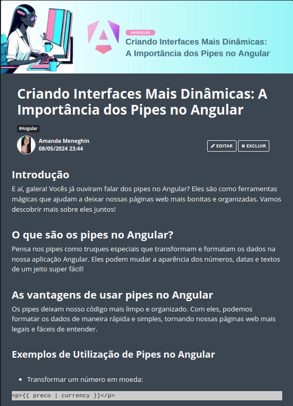

    

---

# Projeto artigo técnico gerado por I.A.s

> ℹ️ **NOTE:** Este é o repositório desenvolvido durante o curso na plataforma da [DIO](https://dio.me)

Projeto com o objetivo de gerar um artigo técnico com um layout rico, leitura agradável e com foco em promover sua autoridade técnica.

<a href="https://web.dio.me/articles/criando-interfaces-mais-dinamicas-a-importancia-dos-pipes-no-angular?back=%2Farticles&open-modal=true&page=1&order=oldest" > 📕Clique aqui para ler o artigo</a>

## 💻 Tecnologias utilizadas no projeto

- [ChatGPT](https://chat.openai.com/)
- [Microsoft Designer](https://designer.microsoft.com/home)
- [GIMP](https://www.gimp.org/)

## 🧠 Prompts

ChatGPT：

|   Ação   | prompt                                                                                                                                                                                                                                                                                                                                                                                                                                                                                                          |
| :------: | --------------------------------------------------------------------------------------------------------------------------------------------------------------------------------------------------------------------------------------------------------------------------------------------------------------------------------------------------------------------------------------------------------------------------------------------------------------------------------------------------------------- |
|  título  | Crie 10 headlines para nomes de artigos sobre o assunto Angular - Pipes                                                                                                                                                                                                                                                                                                                                                                                                                                         |
| conteúdo | Comporte-se como um escritor de artigos tech front-end e escreva o artigo atendendo as regras abaixo {REGRAS} No máximo 5 linhas por blocos de explicação Me explique de maneira informal, como se eu fosse uma criança de 10 anos Os blocos que serão criados estão abaixo: -O que são os pipes no Angular -As vantagens e se utilizar pipes no angular -Cite exemplos com código da utilização de pipes no angular -Faça um call to action para as minhas redes sociais -Coloque 3 hashtags que façam sentido |

Microsoft Designer

|  Ação  | prompt                                                                                                                                                                                                                                                                                                                                                                                                       |
| :----: | ------------------------------------------------------------------------------------------------------------------------------------------------------------------------------------------------------------------------------------------------------------------------------------------------------------------------------------------------------------------------------------------------------------ |
| título | A illustation of a modern woman sitting at her desk with coffee working from home on her dual-monitor computer, her desk is white, she has on glasses to block out the blue light from her monitors, her hair is in a pink hair clip, make her look like a real human and omit any blue colors from the image, i want the picture to be pastel and morandi colors except her hair which should be black hair |

## ✨ Features

- Conteúdo gerado via ChatGPT
- Imagens geradas via Microsoft Designer

## 📚 Materiais

- Imagens utilizadas em `assets`
- prompts utilizados

## 🛠️ Instruções de execução

Utilize os prompts acima nas ferramentas sugeridas para gerar o material base e utilize uma ferramenta de edição de documentos como power point, libreoffice , indesign para diagramação.

## 👨‍💻 Expert

    
    
&nbsp&nbsp&nbspAmanda Nogueira Meneghin 
    &nbsp&nbsp&nbsp
    <a href="https://github.com/anmeneghin">
    GitHub</a>&nbsp;|&nbsp;
    <a href="https://www.linkedin.com/in/anmeneghin/">LinkedIn</a>
&nbsp;|&nbsp;
    <a href="https://www.instagram.com/anmeneghin/">
    Instagram</a>
&nbsp;|&nbsp;

  

